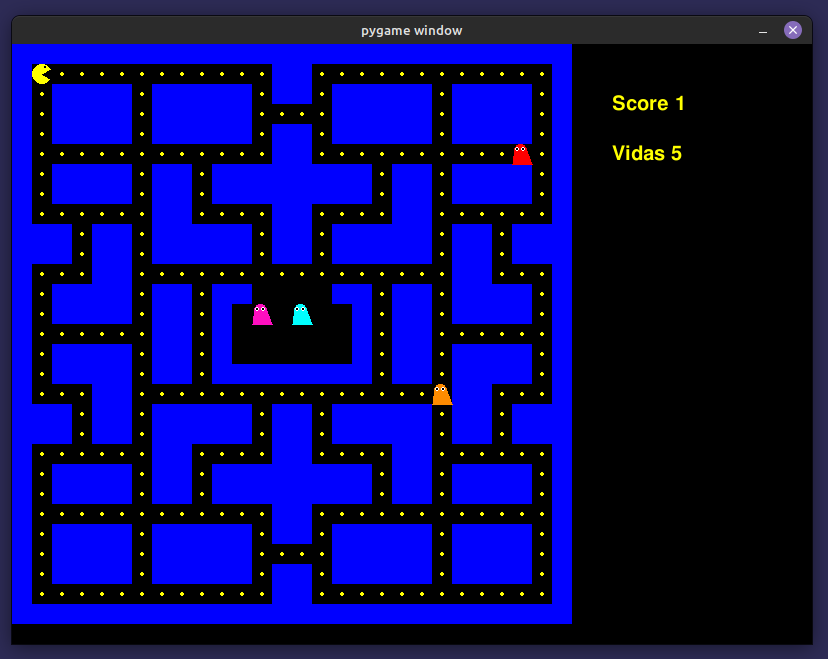
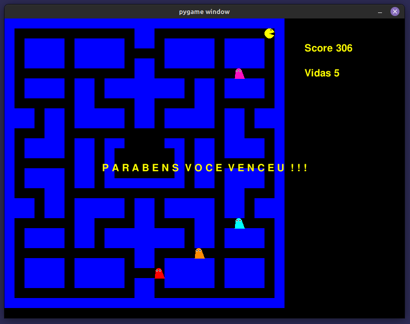
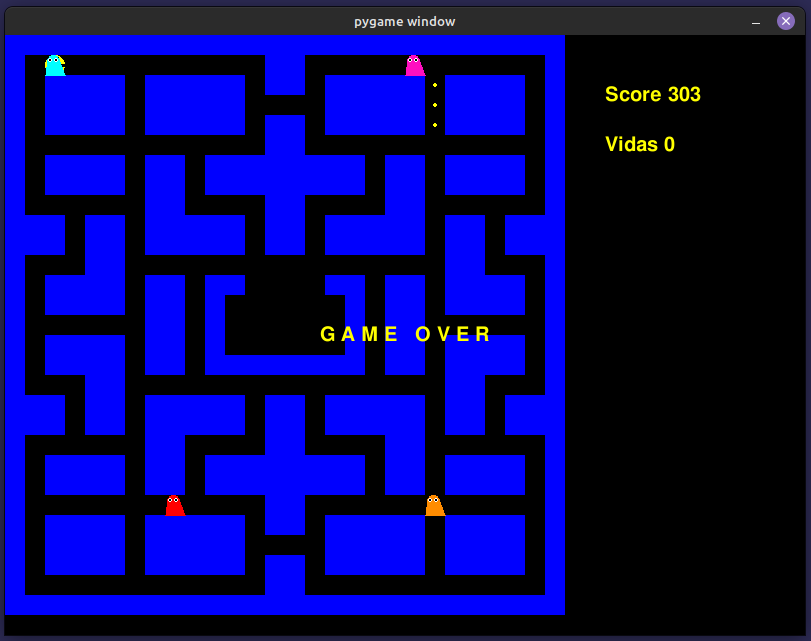

# Pacman Game

**Conteúdo da Disciplina**: Trabalho Final<br>

## Alunos
|Matrícula | Aluno |
| -- | -- |
| 17/0101711  |  Daniel Barcelos Moreira |

## Sobre 
O trabalho consiste em um jogo similar ao pacman e o objetivo é utilizar os conteúdos que foram abordados na disciplina de projeto de algoritmos.

## Screenshots
### Tela inicial


</figcaption>
    Imagem 1: Tela inicial
</figcaption>

### Tela de vitória


</figcaption>
    Imagem 2: Tela de vitória
</figcaption>

### Tela de derrota


</figcaption>
    Imagem 3: Tela de derrota
</figcaption>

## Instalação 
**Linguagem**: Python<br>
**Framework**: Pygame<br>

## Uso 
- Instale o [python 3](https://www.python.org/downloads/);
- Instale o [pygame](https://www.pygame.org/download.shtml);

```
python3 pacman.py
```


